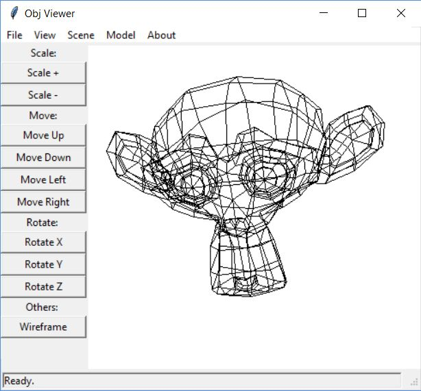

# Readme

School Project !

## Obj viewer



with this application you can view .obj models, scale, move and rotate them.
ATM, there's no support for rendering light, textures or any other complex functions.
You can only view wireframed model.


## Build

to build applicaiton, run build/build.bat or from command line.

```bash
python build.py build
```

*Note: if you want build application from source, you need python modules: tkRAD and cx_freeze*

## Usage

When you start app first time, there's white area, which is scene.
You can add models to scene from top menu *Scene->Add Model*.
If you want delete scene, just clik on *File->New Scene*.
